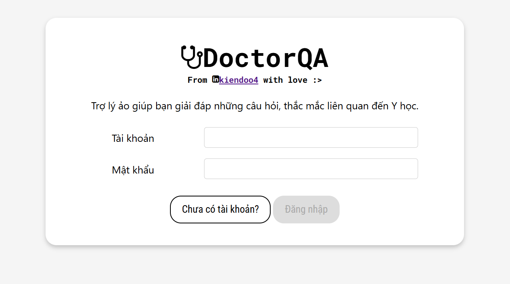
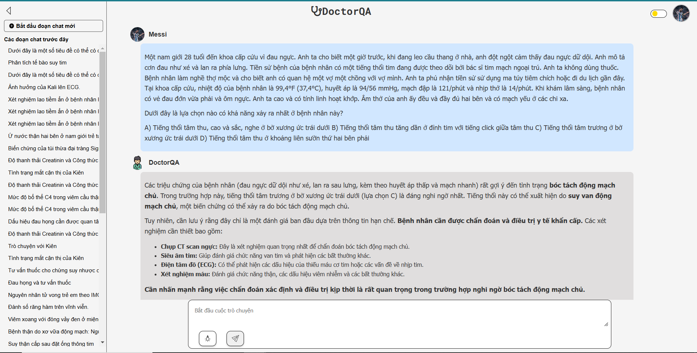

# DoctorQA

DoctorQA is an AI-powered assistant designed to provide accurate and reliable answers to medical questions for Vietnamese. It helps users understand medical concepts, clarify concerns, and navigate health-related topics with ease.



# What I have done?

* Developed an intelligent medical assistant as an exploratory project, using RAG (Retrieval-Augmented
Generation), LangChain framework with LLM (Gemini) to provide accurate healthcare information.
* Crawled and processed 30,000+ medical documents from reputable sources into a Qdrant vector database.
* Designed and maintained PostgreSQL database architecture for user management and conversation logging.
* Designed web interfaces featuring login, registration, and DoctorQA chat functionality.
* Built backend services with Flask to handle user login, chat interactions and API endpoints.
* Leveraged Chain-of-thought prompting to enhance the accuracy and detail of AI-generated responses, resulting in more comprehensive and insightful outputs.

#  Chat with DoctorQA

I asked a question from MedQA-USMLE dataset (which have been translated into Vietnamese)



The answer is correct :>

Users can enhance DoctorQA's responses by applying the Chain-of-Thought strategy, which can be activated by clicking the lightbulb icon in the chat window. This approach, implemented in ```./CoT.py```, has the potential for further improvement as medical research continues to gain attention in the scientific community.

# Technique

## Crawling data

I crawled around 30000 trustworthy documents from ([MSDManual][1]) and ([HelloBacSi][2]). I have cleaned the data, chunked the documents, and converted them into vector representations using ([```bkai-foundation-models/vietnamese-bi-encoder```][3]) - a Sentence Embedding model before storing them in Qdrant. The detailed implementation can be found in the file ```./crawled-data-for-doctorqa.ipynb```.

[1]: https://www.msdmanuals.com/vi/professional "MSDManual"

[2]: https://www.msdmanuals.com/vi/professional "HelloBacSi"

[3]: https://huggingface.co/bkai-foundation-models/vietnamese-bi-encoder ```bkai-foundation-models/vietnamese-bi-encoder```

## AI-Powered Enhancements

To improve DoctorQA’s reasoning and response quality, I have integrated several advanced AI techniques:

* LangChain for Workflow Orchestration: I used LangChain to manage and streamline interactions between the language model (Gemini-1.5) and the database (Qdrant for medical knowledge and PostgreSQL for chatting history), ensuring efficient retrieval, processing of relevant medical information and chatting performance.
* LLM Integration: Gemini-1.5 powers DoctorQA, enabling it to understand and generate context-aware responses.
* Chain-of-Thought Reasoning: Users can activate the Chain-of-Thought (CoT) strategy by clicking the lightbulb icon in the chat.

## PostgreSQL for User and Data Management

DoctorQA leverages PostgreSQL for efficient storage and management of user interactions and structured medical data:

* User Management: PostgreSQL stores user sessions, preferences, and query history, enabling a personalized experience.
* Scalability & Performance: The database architecture supports high-performance querying, allowing seamless interaction with large-scale medical datasets.

# What is next?

In the near future, as DoctorQA becomes more refined, I will publish a demo video showcasing how to use it. Additionally, I aim to learn and integrate Agent-based techniques to further enhance the system.
